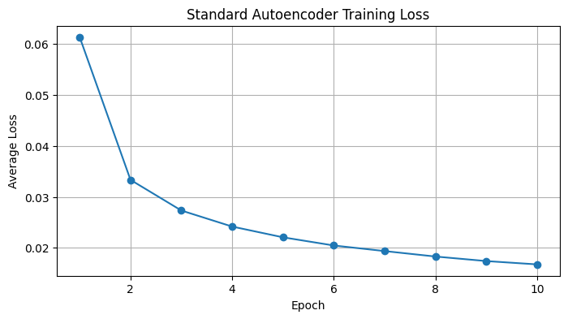
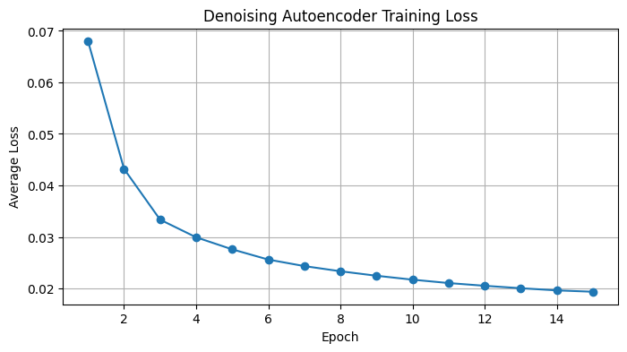
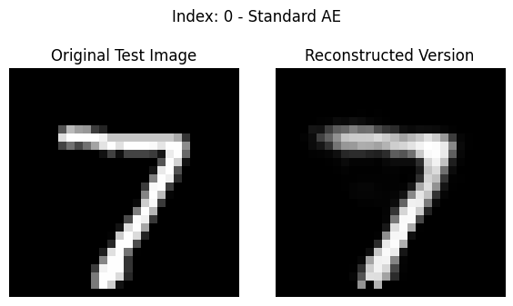
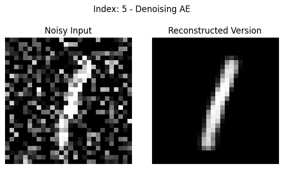

# CS5720: Neural Networks and Deep Learning
## In-Class Programming Assignment 6 (Week 8)

**Github Repo Link:** https://github.com/nidhinninan/NeuralNetwrkDL_CS5720.git 

**Name:** Nidhin Ninan

**ID:** 700772413

## Description
This repository contains an implementation of Autoencoder and Denoising Autoencoder models for processing the MNIST dataset using PyTorch.

## **File:** `ICP_6_NNDL.py`  
**Video Link**: https://drive.google.com/file/d/1-PJnPSKpMet6rLEpqPgZcZ6vEQEcLVKL/view?usp=sharing

## Model Architecture Summary

### Standard Autoencoder
The standard autoencoder model consists of an encoder and decoder with multiple layers:

1. **Encoder:**
   - Input Layer (784 nodes) → Linear(784, 128) → ReLU
   - Hidden Layer 1 (128 nodes) → Linear(128, 64) → ReLU
   - Hidden Layer 2 (64 nodes) → Linear(64, 32) → ReLU
   - Encoding Layer (32 nodes)

2. **Decoder:**
   - Encoding Layer (32 nodes) → Linear(32, 64) → ReLU
   - Hidden Layer 2 (64 nodes) → Linear(64, 128) → ReLU
   - Hidden Layer 1 (128 nodes) → Linear(128, 784) → Sigmoid
   - Output Layer (784 nodes)

### Denoising Autoencoder
The denoising autoencoder uses the same architecture as the standard autoencoder but is trained to reconstruct clean images from noisy inputs with a noise factor of 0.5.

## Implementation Details

### Data Processing:
- Loading MNIST dataset (training and test images)
- Transforming images to tensors
- Flattening 28×28 images to 784-dimensional vectors
- For denoising autoencoder: adding random noise to input images

### Model Configuration:
- Input dimension: 784 (28×28)
- Hidden dimensions: 128, 64
- Encoding dimension: 32
- Learning rate: 0.001
- Batch size: 128
- Training epochs: 10 (Standard AE), 15 (Denoising AE)
- Noise factor: 0.4 (for Denoising AE)

### Model Training:
- Optimizer: Adam
- Loss function: Mean Squared Error (MSE)
- Device: GPU if available, otherwise CPU

### Visualization:
- Training loss plots for both models
- Comparison of original vs. reconstructed images
- Visualization of individual test images and their reconstructions
- For denoising autoencoder: noisy input vs. clean reconstruction

## Features
- Implementation of standard autoencoder with extra hidden layers
- Implementation of denoising autoencoder for noise reduction
- Comprehensive loss tracking and visualization
- Image reconstruction visualization
- Single-image visualization functionality

## Dependencies
- Python 3.x
- PyTorch
- torchvision
- NumPy
- Matplotlib
- MNIST dataset (automatically downloaded via torchvision)

## Model Performance
- The script evaluates both models by visualizing reconstructions
- Displays training loss curves
- Shows original vs. reconstructed images
- For denoising autoencoder: demonstrates noise removal capabilities

## Visualization Outputs
- Training loss plots for both models
- Sample image reconstructions
- Individual test image reconstructions
- Comparison between standard and denoising autoencoder performance

## Notes
- Models include ReLU activation functions in hidden layers
- Output layer uses Sigmoid activation for pixel value normalization (0-1 range)
- Denoising autoencoder is trained with randomly generated noise
- Both models use the same architecture but different training approaches
